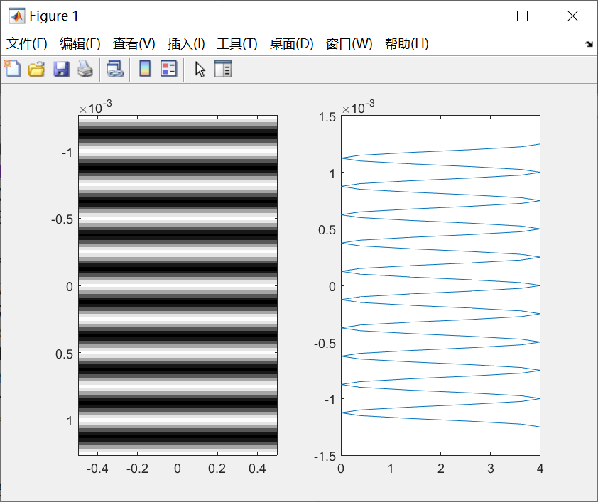
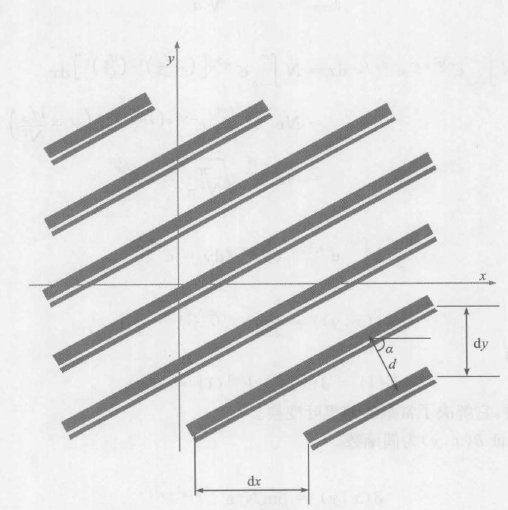
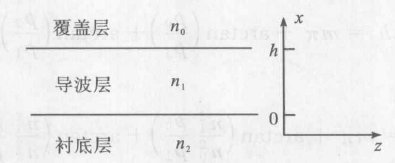

作者：侯学凯 
学号：2018141451161

## 第一章

### 物理光学方法

1. **可以解释光波的干涉和衍射**
2. 说明衍射仪的工作原理
3. 说明干涉仪的工作原理

1960年 激光的发明及应用

    1960年5月15日，美国加利福尼亚州休斯实验室的科学家梅曼宣布获得了波长为0.6943微米的激光，这是人类有史以来获得的第一束激光，梅曼因而也成为世界上第一个将激光引入实用领域的科学家。
    
    激光的理论基础起源于物理学家爱因斯坦，1917年爱因斯坦提出了一套全新的技术理论‘光与物质相互作用。这一理论是说在组成物质的原子中，有不同数量的粒子（电子）分布在不同的能级上，在高能级上的粒子受到某种光子的激发。会从高能级跳到（跃迁）到低能级上，这时将会辐射出与激发它的光相同性质的光，而且在某种状态下，能出现一个弱光激发出一个强光的现象。这就叫做“受激辐射的光放大”，简称激光。

### 相衬显微镜

[**相称显微技术 - 百度百科**](https://baike.baidu.com/item/%E7%9B%B8%E8%A1%AC%E6%98%BE%E5%BE%AE%E6%8A%80%E6%9C%AF/22709023?fr=aladdin)

[**相差显微镜 - 百度百科**](https://baike.baidu.com/item/%E7%9B%B8%E7%A7%B0%E6%98%BE%E5%BE%AE%E9%95%9C/15527012?fr=aladdin)

#### 基本原理

    相差成像
    　　人的眼睛能够识别明与暗之差（光的强度）和颜色不同（光的波长不同），但难以识别差别小的无色的透明物体。
    　　光对无色透明物体（相位物体）并不引起明、暗和颜色的变化，而只产生所谓的相位差。可是这种相位差不能用肉眼识别，也就看不见这种相位物体了。
    　　相差显微镜利用阿贝成像原理，把相位变化转化为振幅变化，是观察透明物体的关键。
    
    光路原理
    　　相差光路比普通光学显微镜多了两个元件：环形光阑（annular diaphragm）和相位板 （annular phaseplate ）
    　　环形光阑：位于光源和聚光器之间。不同的环状孔形成的光阑，它们的直径和孔宽是与不同的物镜相匹配的。由于透明圆环所成的像恰好落在物镜后焦点平面和相板上的共轭面重合。因此，未发生偏斜的直射光便通过共轭面。其作用是将直射光所形成的像从一些衍射旁像中分出来。
    　　相位板：安装在物镜的后焦面处，相板装有吸收光线的吸收膜和推迟相位的相位膜。它除能推迟直射光线或衍射光的相位以外，还有吸收光使亮度发生变化的作用。
    
    利用位相差聚光镜及内部位相环所构成的环状光圈，产生中空光锥通过 聚光镜、穿过检体，经过物镜内的光延迟位环板而成，因检体折射指数不同，造成绕射光束与直射光束发生干涉作用，得到明暗对比的效果。调整位相差装置，先选择聚光镜上与物镜相同倍率之位相差环，所形成的亮环与物镜内的暗环配合，调整聚光镜上亮环，使之重叠即可。

#### 四个特殊结构：

1. 相称物镜
2. 具有环状光阑的转盘聚光器
3. 合轴调中望远镜
4. 绿色滤光片

傅里叶光学：把图像中缓慢变化的成分看作图像的“低频”，而把急剧变化的成分看作图像的“高频”。

光学传递函数：以空间频率为变量，表征成像过程中调制度和横向相移的相对变化的函数。

## 1.1 麦克斯韦方程组

$$
\nabla\cdot\vec{D} = \rho\\
\nabla\times\vec{E} = -\frac{\partial\vec{B}}{\partial t}\\
\nabla\cdot\vec{B} = 0\\
\nabla\times\vec{H} = \vec{j} + \frac{\partial\vec{D}}{\partial t}\\
在无源区域\\
\nabla\cdot\vec{D} = 0\\
\nabla\times\vec{E} = -\frac{\partial\vec{B}}{\partial t}\\
\nabla\cdot\vec{B} = 0\\
\nabla\times\vec{H} = \frac{\partial\vec{D}}{\partial t}
$$

散度： 

$$
\nabla\cdot\vec{A}=\frac{\partial A_x}{\partial x}+\frac{\partial A_y}{\partial y}+\frac{\partial A_z}{\partial z}
$$

旋度：

$$
\nabla\times\vec{A}=
\left|
    \begin{matrix}
        e_x&e_y&e_z\\
        \frac{\partial}{\partial x}&\frac{\partial}{\partial y}&\frac{\partial}{\partial z}\\
        A_x&A_y&A_z\\
    \end{matrix}
\right|
= (\frac{\partial F_z}{\partial F_y}-\frac{\partial F_y}{\partial F_z})\vec{x_0}+(\frac{\partial F_x}{\partial F_z}-\frac{\partial F_z}{\partial F_x})\vec{y_0}+(\frac{\partial F_y}{\partial F_x}-\frac{\partial F_x}{\partial F_y})\vec{z_0}
$$

### 波动方程

$$
\nabla^2 \vec{E} - \frac{1}{v^2}\frac{\partial^2E}{\partial t^2} = 0
$$

### 亥姆霍兹方程

$$
\nabla^2 U(r) + k^2 U(r) = 0
$$

### 光外差探测

[光外差探测 - 百度百科](https://baike.baidu.com/item/%E5%85%89%E5%A4%96%E5%B7%AE%E6%8E%A2%E6%B5%8B/22689344?fr=aladdin)

    光外差探测的基本原理是基于两束光的相干。必须采用相干性好的激光器作光源，在接收信号光的同时加入本振光。本振光的频率与信号光频率极为接近，使本振光和信号光在光电探测器的光敏面上形成拍频信号。只要光电探测器对拍频信号的响应速度足够高，就能输出中频光电流，从而检测出信号光中的调制信号。由于光外差探测是基于两束光波在光电探测器光敏面上的相干效应，所以光频外差探测也常常称为光波的相干探测。


### 证实电磁波的传播速度等于光速

赫兹
1. 用驻波方法先测出驻波波节波长
2. 根据麦克斯韦电磁波速等于光速，算出该的电磁波的振荡周期
3. 利用振荡器振荡周期公式，计算出偶极振荡器的振荡周期

### 物质方程

物质方程描写物质在电磁场作用下的特性：

$$
D = \varepsilon(E_1,E_2,E_3)\\
B = \mu(H_1,H_2,H_3)\\
j = \sigma(E_1,E_2,E_3)
$$

各向同性介质满足：

$D=\varepsilon E ,B=\mu H,j=\sigma E$

电磁波在介质中传播速度：$v=\frac{1}{\sqrt{\varepsilon\mu}}$

电磁波在真空中传播速度：$c=\frac{1}{\sqrt{\varepsilon_0\mu_0}}$

折射率：$n = \sqrt{\varepsilon_r\mu_r}$

由于大多数物质的$\mu_r\approx1$,因而有麦克斯韦关系式：$n=\sqrt{\varepsilon_r}$

### 边界条件

$$
\oiint \vec{B}\cdot\vec{n}ds = 0\\
n_{12}\cdot(\vec{B_1}-\vec{B_2})=0\\
\iiint\rho dV = \oiint \vec{D} \cdot \vec{n}ds\\
D_1 \cdot n_{12} - D_2 \cdot n_{12} = \rho_{sur}
$$

通过突变面时磁感应强度法向分量连续。

当两介质交界处存在面电荷时，电位移矢量的法向分量发生突变，改变量等于表面电荷密度；当界面没有面电荷时，电位移矢量的法向分量连续。

在通过两介质交界面时电矢量的切向分量是连续的。

当存在面电流密度$j_{sur}$时，H矢量切向分量发生突变，突变量为$j_{sur}\times\vec{n_{12}}$;当没有面电流时，H矢量切向分量连续。

### 波动方程推导

波动方程推导来源于简化的麦克斯韦方程组。

$$
\nabla\cdot\vec{D} = 0\\
\nabla\times\vec{E} = -\frac{\partial\vec{B}}{\partial t}\\
\nabla\cdot\vec{B} = 0\\
\nabla\times\vec{H} = \frac{\partial\vec{D}}{\partial t}\\
$$

$$
\nabla\times(\nabla\times E) = \nabla(\nabla\cdot E) - \nabla^2 E\\
\nabla\times(-\frac{\partial B}{\partial t}) = -\nabla^2 E\\
$$


$$
\mu\nabla\times(-\frac{\partial H}{\partial t}) = -\nabla^2 E\\
$$

$$
-\mu \frac{\partial}{\partial t}(\nabla\times H) = -\nabla^2 E\\
$$


$$
-\mu \frac{\partial}{\partial t}(\frac{\partial D}{\partial t}) = -\nabla^2 E\\
$$

$$
-\mu\varepsilon\frac{\partial}{\partial t}(\frac{\partial E}{\partial t}) = -\nabla^2 E\\
\nabla^2 \vec{E} - \frac{1}{v^2}\frac{\partial^2E}{\partial t^2} = 0
$$

### 平面波的波函数

波函数就是波动方程的解，波动方程有平面波、球面波、柱面波等多种形式的解，各种简谐波及其叠加也是波动方程的解。

$$
E(r,t) = Acos(\frac{\omega}{c}nk_0\cdot r - \omega t)
$$

k称为波矢，其定义为$k=\frac{\omega}{c}nk_0$

大小为波数，$k=\frac{\omega}{\upsilon}$

k的方向是波阵面的法线方向。$\lambda$为光波在介质中的波长，w是角频率。有如下关系：

$$
\omega = 2\pi\upsilon = \frac{2\pi}{T},\lambda = \upsilon T ,\lambda_0 = cT, \lambda = \frac{\lambda_0}{n}
$$

为方便运算，常将平面光波的波函数写成复数形式：

$$
E(r,t) = Aexp[i(k\cdot r - \omega t)]
E(r) = Aexp(ik\cdot r)
$$

球面波的波函数
$$
E(r,t) = \frac{A_1}{|r|}exp[i(kr-\omega t)]\\
$$
柱面波
$$
E(r,t) = \frac{A_1}{\sqrt{|r|}}exp[i(kr-\omega t)]
$$

### 能量守恒

坡印廷矢量

$S = E\times H = \frac{1}{\mu}E\times B$

光强I与平面波的振幅A的平方成正比。

$$
 I = \frac{\sqrt{\frac{\varepsilon}{\mu}}A^2}{2}
$$

### 光压

当一束光照射到物体表面上时，由于吸收和反射，光的动量将发生变化。根据动量转换和守恒，

电磁动量流密度：$g= \frac{S}{c^2} = \frac{w}{c}$

光压表示为：$p=\frac{1+R}{2c}(H\cdot B + E \cdot D)$

R为反射系数

### 光的偏振

光的偏振态：在垂直于光的传播方向的平面上，光矢量可能有不同的振动状态，通常称为光的偏振态。

就偏振状态而言，光分为三类：自然光、完全偏振光和部分偏振光，通常用偏振度表示偏振的程度。

$$
P = \frac{I_{max}-I_{min}}{I_{max}+I_{min}}
$$

当$I_{max} = I_{min}$ ，偏振度为0，自然光

当$I_{min} = 0$ ,偏振度P=1，完全偏振光

当偏振度在0~1之间时，就是部分偏振光。

偏振片： 用来产生偏振光的偏振片叫起偏器，用来检验偏振光偏振状态的偏振片叫检偏器。

马吕斯定律：$I = I_0 cos^2\alpha$

### 光的吸收、色散、散射

光的吸收：

$I=I_0exp(-KI)$，朗伯定律吸收定律

$I$是从厚度为$l$的薄层出射后的光强。

溶液中：$I=I_0exp(-\alpha\rho l)$，比尔吸收定律

光的色散：

光波在介质中的传播速度或折射率随波长而变的现象称为光的色散。折射率随波长变化的曲线就是色散曲线。介质的色散程度用色散率来表示，它的定义是介质折射率随波长变化的快慢。即
$$
\frac{n_2-n_1}{\lambda_2-\lambda_1} = \frac{\Delta n}{\Delta\lambda} = \frac{dn}{d\lambda}
$$

光的色散可分为正常色散和反常色散。

柯西色散公式：

$$
n=a+\frac{b}{\lambda^2} + \frac{c}{\lambda^4}
$$

光的散射：

光通过不均匀介质（有随机运动的分子、原子、烟雾或尘土的气体，混入小颗粒的液体，以及存在缺陷的晶体等）产生的偏离原来传播方向、向四周散射的现象，就是光的散射。

从分散系的角度来看，介质可看做由一种（或几种）物质的微粒（分子、离子或分子集合体等）分布在另一种物质中而形成的混合物。

丁达尔效应：当一束光线透过胶体，从入射光的垂直方向可以观察到胶体里出现一条光亮的“通路”，这种现象叫做丁达尔现象。

瑞利散射：

瑞利散射适用于孤立原子或分子的散射，也适用于纯净介质的密度起伏导致的散射。当粒子的尺寸小于可见光波长时，瑞利散射具有以下几个特征：
1. 波长不变，即散射光波长与入射光波长相同。
2. 散射光强度与波长四次方成反比
3. 瑞利散射具有光波长的选择性，波长较短的光比波长较长的光散射强烈。
4. 瑞利散射光强具有方向的选择性，散射光强依空间方位成哑铃形角分布
    设入射光是自然光，则在与入射光方向成$\theta$角的方向上，散射光强为$I=I_{\perp}(1+cos^2\theta)$
5. 瑞利散射具有一定的偏振度
    当自然光入射时，各方向的散射光一般为部分偏振光，但在垂直入射光方向上的散射光是线偏振光，沿入射光方向或其逆方向的散射光仍是自然光。线偏振光入射时，散射光也为线偏振光。

反射和折射定律

有任意偏振方向的平面波都可分解为s波（垂直）和p波（平行）

反射折射定律：

$$
n_1sin\theta_1 = n_2sin\theta_2
$$


## 第二章

### 单色波的干涉

干涉现象：两束或更多的光波在空间叠加时，在叠加区域的光强从一点的最大值变到另一点的最小值，最大值大于那一点所有光束光强之和，最小值可以变为0，这种现象就是干涉。

### 波的叠加原理

在几列波相遇而互相交叠的区域中，某点的振动是各列波单独传播时在该点引起的振动的合成。

### 产生干涉的基本条件

1. 频率相同
2. 有恒定的相位差
3. 振动方向相同

### 杨氏双缝干涉


位相差为：
$$
\delta = k\Delta = \frac{2\pi}{\lambda}\Delta \approx \frac{2\pi}{\lambda}(\Delta R+\frac{yd}{D})
$$

**单色光杨氏双缝干涉程序**

``` matlab
clear all
lam=500e-9;
d=2e-3;
D=1;
ym=5 *lam* D/d;
xs=ym;
n=101;
ys= linspace( -ym,ym,n);
for i= 1:n
rl = sqrt((ys(i) - d/ 2).^2+ D^2);
r2=sqrt((ys(i) + d/ 2).^2+ D^2);
phi=2 * pi* (r2- rl)./ lam;
B(i,:) = sum(4 * cos(phi/ 2).^2);
end
N= 255;
Br= (B/ 4) * N;
subplot(1, 2, 1)
image(xs,ys,Br);
colormap(gray(N));
subplot(1, 2, 2)
plot(B,ys)

```



### 两个单色波的叠加

``` matlab
clear all 
T=1; 
t= -1.50 * T: 0.002: 1.5 * T; 
delta_tl =[0 0.1 0.2 0.3 0.4 0.5]; delta_t2=[0 0. 15 0. 25 0. 35 0. 45 0. 55]; 
figure(1); hold on; figure(2); hold on; 
for number_i = 1: 6 
yl=cos(2 *pi* t/T); 
y2= cos(2 * pi/T * (t+delta_tl(number_i))); 
y3= cos(2 * pi/T * (t+delta_t2(number_i))); 
figure(1); plot(t, yl +y2,'ro');
figure(2); plot(t, yl +y2+y3,'go'); end 
figure (1) ; xlabel ('t/T') ; title ('两个余弦波的叠加'); figure(2); xlabel('t/T'); title('三个余弦波的叠加');
```


从上面的结果可以看出，多个同频率、同振动方向、同传输方向的余弦波相干叠加，振动频率不变，相位差仅影响相干合成波的振幅。

### 时间相干性

实际使用的光源（例如鸽丝灯、太阳光）大都是含有各种波长的白光。即使是常规的单色光源，如钠光灯，它所辐射的光也有一定的波长范围。激光也有一个相当小的波长范围。
若光波的波长范围从$\lambda$到$\lambda+\Delta\lambda$（$\Delta\lambda$为波长宽度），那么，当光波传播一定的距离后，波长为$\lambda$的光波的波峰和波长为$\lambda+\Delta\lambda$的光波的波谷将互相重叠，导致干涉现象消失，这段距离称为相干长度$L_c$。光通过这段距离所需要的时间称为相干时间$\tau_c$。$\Delta\lambda$越小，单色性越好。Lc ,Tc 无限长的光称为单色光，它的$\Delta\lambda$=O 。光的这种性质称为时间相干性。相干长度表示为
$$
L_c = \frac{\lambda^2}{\Delta\lambda}
$$

相干时间为：

$$
\tau = \frac{L_c}{c}
$$

### 波长不同的两个波叠加

``` matlab
clear all
lamdal = 4 ; lamda2= 4.5;
resultl =zeros(4001, 1);
x= linspace(-200, 200,4001);
for i=1:length(x)
resultl(i)=resultl(i) + cos(2 *pi* x(i) / lamdal) + cos(2 *pi* x(i) / lamda2);
end
subplot(2, 1, 1)
plot(x, resultl,'r-')
xlabel('x');
ylabel('E(x)');
hold on
subplot(2, 1, 2)
plot(x,resultl.* resultl,'r- ')
ylabel('I(x)');
xlabel ('x');

```


### 空间相干性

如果两束光是同一个光源产生的，则它们的波动或多或少是相关的，其相关性取决于光源的性质；如果两束光来自两个不同的光源，则其波动完全不相关，两束光也互不相关。它们的叠加不会引起干涉，强度等千各束光强度之和。

#### 光源宽度对干涉条纹衬比度的影响


可以看到，对于点光源极限宽度$\delta x = \frac{\Delta x}{2}$
对于面光源，极限宽度

$$
b_0 = \frac{R}{D} \Delta x = \frac{R}{d}\lambda
$$

强度分布推导为：


两点光源的杨氏双缝干涉强度，改变两个点光源之间距离

``` matlab
clear
lambda= 0.0005;
a= 1;
d= 0.05;
Z= 9000;
Y=-6:0.01:6;
X= 1000;
theta= Y/ X;

s1 = 0; s2= 1.5; s3 = 2.25; s4 = 2.6; %不同光源间距
phi1 = s1 / 2; phi2= s2/ 2; phi3= s3 / 2; phi4= s4/ 2; % 不同夹角
p= sin(pi * d * sin(theta) / lambda).^2. / (pi * d * sin(theta) / lambda).^2; %单缝衍射因子
IO = p.* cos(pi * a * sin(theta) / lambda) .^2;
I1 = p.* cos(pi * (a/ lambda)* (sin(theta) + sin(phi1))).^2;
I2= p.* cos(pi * (a/ lambda) * (sin(theta) + sin(phi2))).^2;
I3= p.* cos(pi * (a/ lambda)* (sin(theta) + sin(phi3))).^2;
I4= p.* cos(pi* (a/ lambda)* (sin(theta) + sin(phi4))) .^2;
I1= IO+ I1; %总相对光强
I2 = IO + I2; % 总相对光强
I3 = IO + I3; % 总相对光强
l4=IO + I4 ; % 总相对光强
figure %创建图形窗口

axis([ -0. 006 0. 006 0 2])
subplot(4, 1, 1)
plot(theta,I1,'r--')
legend('s=0');
subplot(4, 1, 2)
plot (theta, I2 , 'r--')
legend('s=l. 5');
subplot(4,1,3)
plot(theta, I3,'r--')
legend('s=2. 25');
subplot(4, 1,4)
plot(theta, I4,'r--')
legend('s=2. 6');
xlabel( '观察屏上位置Y(mm)');
ylabel( '相对强度I');

```


#### 光源的空间相干性

以上讨论了杨氏双缝中光源宽度对衬比度的影响。

$$
b_0 = \frac{R}{d}\lambda\\
b \Delta \theta_0 \approx \lambda\\
\Delta \theta_0 是相干范围孔径角
$$

### 等倾干涉


光程差：

$$
\Delta L = 2nh\cos i
$$
``` matlab
clear
rm= 5;
R= -rm: 0.01 :rm;
f= 4;
D=0.01;
r=0.85;
lambda= 0.0005;
[X, Y] = meshgrid(R);
R= sqrt(X.^2 + Y.^2);
i= R./ f;a
phi= 2 *pi * 2 * D * cos(i) / lambda;
F = 2 * r/ (1-r^2);

I= 1./ (1 + F^2. *sin(phi/2).^2);
I(R> 4) = nan; 
imshow(I);
```


#### 等厚干涉


光程差：

$$
\Delta L = 2nh\cos i
$$

``` matlab

clear
alpha= 0.02;
lambda= 0.005;
x= 0:0.01:1.5;
i= cos(2 *pi* x * tan(alpha) / lambda+ pi/2).^2;
fs = 12;
figure
subplot(2, 1, 1)
plot(x, i,'r--')
xlabel(' 条纹距棱线的距离x','fontsize', fs) ;
ylabel( '相对强度I','fontsize', fs) ;
subplot(2, 1, 2)
colormap(gray(255));
image(i * 255)
axis off

```


#### 牛顿环


第N个暗环应满足条件为：

$$
R = \frac{r_N^2}{N\lambda}
$$

#### 迈克尔逊干涉仪


 

简单来说，等倾条纹时两板平行，等厚干涉时两板之间有一个小夹角。

等厚条纹：

``` matlab
clear all
D= 0.027: 0.00001: 0.0325;
lambda= 0.0005;
theta= 0;
I= cos(2 *pi* D* cos(theta) / lambda).^2;
plot(D,I,'r--');
xlabel('D');
ylabel(' 相对光强I');
```


等倾干涉：

``` matlab
clear all
D= 0.03;
lambda= 0.0005;
theta=-0.301 :0.001 :0.3;
I= cos(2 *pi* D* cos(theta) / lambda).^2;
plot(theta,I,'r--');
xlabel('D');
ylabel(' 相对光强I');
```


## 第三章

### 惠更斯菲涅耳原理

波前∑上每一个面源d∑都可以看成是新的振动中心，它们发出次波。在空间某一点P的振动是这些次波在该点的相干叠加。

### 菲涅耳衍射积分公式


### 巴比涅原理

两个互补屏单独产生的衍射场复振幅之和等于没有衍射屏时的复振幅。

### 夫琅和费衍射和菲涅耳衍射

#### 傍轴近似

若点光源P0和观察点P到屏的距离与孔径尺寸相比很大，则

$$
\cos(n,\rho)-\cos(n,r) \approx 2\\
\frac{1}{r\rho} = \frac{1}{r_0\rho_0}
$$


#### 菲涅耳近似


#### 夫琅和费近似


### 衍射问题在频率域的表示

#### 菲涅耳衍射


#### 夫琅和费衍射


### 夫琅和费衍射


#### 矩孔衍射


```matlab
clear all
lamda = 632.8e-9;
a=5e-3;
b = 5e-3;
f=0.01
x=-10 * a:0.0001:10 * a; 
y= - 10 * b:0.0001:10 * b; 
lenm= length(x); 
lenn= length(y); 
for m = 1: lenm 
for n= 1: lenn 
alpha = pi * x(m) * a/(lamda * f); 
beta= pi * y(n) * b/(lamda * f); 
I(m, n) = ((sin(alpha)) / (alpha))^2 * ((sin(beta)) / (beta))^2; 
end 
end 
I= I/(max(max(I))); 
figure 
imshow(255 * I) 
xlabel('x');
ylabel('y'); 
```


#### 单缝的夫朗和费衍射

对于单缝夫琅和费衍射，衍射强度分布为：


他的计算方法除了利用上面与矩孔计算时复振幅积分的方法之外，还可以通过矢量图解法


``` matlab
lamda= 632.8e-9;
a= 1e-3;
f= 1 ;
m= 200;
xm= 3 * lamda * f/a;
xs= linspace(-xm, xm,m);
ys= linspace(0,a,m);
for i= 1 :m
sinthi= xs(i) / f;
alpha= 2 *pi* ys * sinthi/ lamda;
sumcos= sum(cos(alpha));
sumsin= sum(sin(alpha));
col(i,:)= (sumcos^2+ sumsin^2) / m^2;
end
plot (xs, col)
```


### 双缝的夫琅和费衍射


**可以看出，双缝夫琅和费衍射是一种被单缝衍射调制的双缝干涉条纹。**

``` matlab
clear
lamda= 632.8e-9;
a= 1e-3;
d= 5 * a;
f= 1;
m= 1000;
xm= lamda * f/a;
ys= xm;
xs= linspace( -3 * xm,3 * xm,m);
yl = pi *a* xs/ lamda/ f;
y2 = sin(yl);
y3 = cos(pi * d * xs/ lamda/f);
y4 = y2./ yl.* y3;
ll= y4.* y4;
subplot(2, 1, 1);
n= 255;
I_gray= (ll / max(ll)) * n;
image(ys, xs, I_gray);
colormap(gray(n));
subplot(2, 1, 2);
plot(xs, I1);
```


### 多缝夫琅和费衍射


同样的，多缝夫琅和费衍射我们也可以使用矢量图解方法来计算


多缝夫琅和费衍射的特点：

1. 曲线的包络与单缝衍射因子一样，包络的最小光强位置满足

$$
\sin(\frac{\pi bx}{\lambda f}) = 0\Rightarrow x = \frac{k\lambda f}{b}
$$

2. 在单缝衍射的每个条纹中，出现了细小的阴暗相间的条纹，其中亮度明显较强的称为该条纹中的主极大，他们满足条件

$$
\sin(\frac{\pi dx}{\lambda f}) = 0\Rightarrow x = \frac{j\lambda f}{d}
$$

3. 每条单缝衍射条纹中的主极大的宽度随N的增大而减小，强度与$N^2$成正比
4. 相邻主极大之间有N-1个暗条纹，有N-2个次极大
5. 若干涉产生的主极大恰好在单缝衍射的暗条纹位置，即b/k=d/j时，则合成光强为0，出现缺级现象。


``` matlab
clear
lamda=632.8e-9;
a=1e-3;
d=5 * a;
f= 1;
N=10 ;
m=1000 ;
xm= lamda * f/a;
ys=xm;
xs= linspace(-xm,xm,m);
for i= 1: m
    sinthi= xs(i) / f;
alpha= pi *a* sinthi/lamda;
beta=pi * d * sinthi/lamda;
I(: ,i) = (sin(alpha)./ alpha).^2 * (sin(N * beta)./( sin(beta))).^2;
i1 = I/ max(I);
end
subplot(2, 1, 1);
n= 255;
I_gray=(i1 / max(i1)) * n;
image(xs, ys, I_gray);
colormap(gray(n));
subplot(2, 1, 2);
plot(xs, i1);
```


### 夫琅和费圆孔衍射

圆孔衍射强度分布公式为：

$$
I(\theta) = I_0[\frac{2J_1(x)}{x}]^2
\\
x = \frac{2\pi a}{\lambda}\sin\theta
$$
J(x) 是一阶贝塞耳函数

圆孔的零级衍射班称为艾里斑，其大小用第一暗环角半径$\Delta\theta$来衡量。

$$
\Delta\theta = 0.61\frac{\lambda}{a} = 1.22\frac{\lambda}{d}
$$


``` matlab
clear all
close all
clc
lamda= 632.8e-9;
a= 0.0005;
f= 1;
m= 300;
ym= 4000 * lamda * f;
ys= linspace( - ym, ym, m) ;
xs= ys;
n= 255;

for i=1: m
r=xs(i)^2+ys.^2;
sinth=sqrt(r./ (r+f^2));
x= 2 * pi * a * sinth./ lamda;
hh= (2 * besselj(1,x)).^2 ./ x.^2;
b(: ,i) = hh'* 5000;
end
figure(1)
subplot (1, 2, 1) ;
b_1 = 255 * b/max(max(b));
image(xs, ys, b_1);
colormap(gray(n));
subplot (1, 2, 2);
plot(xs, b_1(:, m/2)); xlabel('Rsin\theta/ \lambda') ;ylabel('I/I_max');

figure(2)
subplot (1, 2, 1);

log_b=log(b);
log_b=log_b+abs(log_b);
b_1=255 * log_b/ max(max(log_b));
image(xs, ys, b_1) ;
colormap(gray(n)) ;
subplot(1, 2, 2);
plot(xs, b_1(:, m/ 2)); xlabel('Rsin\theta/ \lambda');
ylabel('I/ I_max');
```


### 几种常用光学成像系统的分辨本领

1. 人眼的分辨本领
   - 最小分辨角 
$$
\alpha_e \approx 1.22\frac{\lambda}{D_e}
$$
2. 望远镜的最小分辨角
$$
\alpha \approx 1.22\frac{\lambda}{D}
$$

3. 照相物镜的分辨本领
$$
N = \frac{1}{\epsilon'} = \frac{D}{1.22f\lambda}
$$
4. 显微镜的分辨本领
    - 最小距离
$$
\epsilon' = 1.22\frac{\lambda}{D}d
$$

### 菲涅耳圆孔衍射

#### 菲涅耳波带法


推导得出，圆孔半径与波带数的关系为：

$$
R_m^2 = \frac{\rho m\lambda b}{\rho+b}
\\
m = \frac{R_m^2}{\lambda}\frac{\rho+b}{\rho b}
$$

#### 矢量图解法


#### 菲涅耳波带片

在菲涅耳圆孔衍射时，相邻波带的位相相反，作用相互抵消。若将N 个奇数带（或偶数带）挡住，只留下偶数（或奇数带），则在几点的合振幅为2Na1 （a1 为波前完全不被挡住时的振幅），光强则变为4N^2I0。(I0为波前完全不被挡住时的光强） 。这种将奇数波带或偶数波带挡住的特殊的光阑称为菲涅耳波带片

$$
\frac{1}{\rho} + \frac{1}{b} = \frac{N\lambda}{R_N^2}
$$

与透镜成像公式相似，可以视为波带片对轴上物点的成像公式。

### 光栅光谱仪

$$
d\sin\theta = k\lambda
$$

- 色散本领

角色散：

$$
\frac{d\theta}{d\lambda} = \frac{m}{d\cos\theta}
$$

- 线色散：

$$
\frac{dl}{d\lambda} = f\frac{d\theta}{d\lambda} 
$$

- 分辨本领

$$
A = \frac{\lambda}{\Delta \lambda} = mN
$$

可见，光栅分辨本领只与m和N有关，与光栅常数无关。

## 第四章

### 傅里叶光学

傅里叶光学可以分为两部分：
1. 傅里叶光谱仪中存在的变换关系：干涉图->光谱图
2. 相干成象系统和非相干系统中存在的变换关系：物->像

### 空间频率

光学信号可以在频域中描述，把图像的亮度变化部分看作光信号的低频成分，把图像中的细节和急剧变化的部分看作光信号的高频成分。

光波的空间频率是指在空间呈正弦或余弦分布的物理量在某个方向上单位长度内重复的次数。相邻两条线的空间距离d就是空间周期，空间周期的倒数，f=1/d表示的是在单位长度内的重复数，也就是空间频率



$$
f_x = \cos\alpha / d
$$

平面波的空间频率

$$
f_x = \frac{\cos\alpha}{\lambda} \\
f_y = \frac{\cos\beta}{\lambda}
$$

其中cosa和cosb分别为x和y方向上的方向余弦

### 傅里叶变换基本定理

1. 线性定理

2. 相似性定理

3. 位移定理

4. 维纳辛钦定理

5. 巴伐塞定理

6. 两次变换定理

7. 矩定理


### 傅里叶变换的光学模拟

#### 相移定理


### 4-f系统

[4-f系统推导--百度文库](https://wenku.baidu.com/view/83fba8b60b4c2e3f56276361.html)

简而言之，4-f系统就是两个相距为2f的焦距为f的薄透镜形成的系统，在L1的前焦面放置函数E1，在L1后焦面放置E2（频谱函数），那么通过E2后得到两个频谱的乘积，那么在L2后焦面就得到了e1*e2的结果

### 抽样定理

为了防止出现频谱混叠，需要满足

$$
\frac{1}{\delta x} \geq 2B_x \\
\frac{1}{\delta y} \geq 2B_y
$$

### 光学系统的拦光效应和低通滤波

由于光学系统的孔径是有限的，那么来自物体的光波只有一部分能够进入光学仪器，随着传播方向与光轴的夹角θ的增大，高频衍射波被光阑拦掉而不能通过，因此光学仪器是低通滤波器

### 相干成像和相干传递函数

$$
f_x = \frac{NA}{\lambda} 相干系统的截止频率
\\
$$

对于相干照明，其CTF为

$$
H(f_x,f_y) = P(\lambda d_i f_x,\lambda d_i f_y)
$$

### 非相干成像系统和光学传递函数

OTF函数的形式为

$$
\frac{H_i(f_x,f_y)}{H_i(0,0)}
$$

当两光瞳刚好完全分离时，OTF值为0，此时频率为截止频率

## 第五章

### 单层膜


反射光合成振幅为

$$
A_r = \frac{r_1+r_2exp(i\delta)}{1+r_1r_2exp(i\delta)}A_i
$$

透射光的合成复振幅为

$$
A_t = \frac{t_1t_2}{1+r_1r_2exp(i\delta)}A_i
$$

$$
\delta = \frac{2\pi}{\lambda}2nh\cos\theta
$$

### 菲涅耳公式


### 多层膜

分析多层膜的方法是等效反射面。首先将最靠近基片的膜层与基片组合，看成是一个单层膜，计算出它们的振幅反射率，这样可以等效为一个反射分界面。然后再将次靠近基片的膜层与等效反射面结合，又看成是一个单层膜，再计算出它们的振幅反射率，还是可以等效为一个反射分界面。以此类推，最终求得整个膜系的反射系数和反射率

### 干涉色

由于薄膜的反射率随波长而异，所以当用白光照射是，可以看到反射光带有漂亮的颜色


### 平板波导



平板波导传输光的基本原理就是界面全反射

## 第六章

### 双折射

一束自然光通过各向异性晶体时，折射光线分为两束，并且都是完全线偏振光，这就是双折射现象。

其中o光遵守光的折射定律，e光不遵守光线折射定律

### 晶体光轴

 晶体中存在一个或两个特殊的方向，沿着这个方向传播的光不发生双折射现象 ，这一特殊方向称为晶体的光轴。（光轴并不是经过晶体的某一条特殊的直线，它是一个方向）

 ### 主平面和主截面

 晶体中光线与光轴构成的平面叫该光线的主平面。

 当光线入射在晶体的某一晶面上时，该晶面的法线与晶体的光轴组成的平面叫做晶体的主截面。

 o光的光矢量振动方向与0光主平面垂直，故总是与光轴垂直，e光的光矢量振动方向在e光主平面内，与光轴夹角随着光传输方向不同而不同

### 折射率曲面

折射率曲面可以直接地表示与每一个波法线方向k0相对应的两个特许光线偏振光的折射率

负单轴晶体折射率曲面：


### 惠更斯作图法


简单来说，就是画出波矢曲面，通过包络波矢曲面来确定o光和e光方向

### 波片

将单轴晶体平行与光轴方向切割加工的表面平行、厚度均匀的薄晶片

入射光经双折射产生o光和e光后，因为折射率不同会产生光程差

$$
\delta = \frac{2\pi}{\lambda}|n_o-n_e|d
$$

**波片只针对某一特定波长**

### 补偿器

采用补偿器，可以得到任意的位相差


### 偏振棱镜

偏振棱镜是利用晶体的双折射，通过棱镜间组合获得线偏振光


### 电光效应

因外加电场使介质光学性质发生变化的效应叫做电光效应。

若晶体的折射率差与所加电场的一次方成正比，那么称为线性电光效应，或普克尔效应

若折射率差值与电场强度平方成正比，那么就是二次电光效应或克尔效应

### 旋光现象

线偏振光通过旋光晶体，光传播方向与光轴方向一致是，可观察到单纯的偏振面沿传播方向为轴旋转一定角度，这就是旋光现象

光旋转角度与在该介质中通过距离成正比

$$
\theta = \alpha l
$$

### 磁光效应

在强磁场的作用下，物质的光学性质发生改变的现象叫做磁光效应。

1. 法拉第效应：介质在强磁场作用下产生旋光
2. 康顿莫顿效应：液体介质在强磁场作用下产生双折射性质。

## 第七章

### 康普顿效应

$$
\lambda'-\lambda = \frac{2h}{m_0c}\sin_2\frac{\phi}{2}
$$

### 经典电磁理论在解释康普顿效应时遇到的困难

1. 根据经典电磁波理论，当电磁波通过物质时，物质中带电粒子将作受迫振动其频率等于入射光频率，所以它所发射的散射光频率应该等于入射光频率
2. 无法解释波长改变和散射角的关系

### 光子理论对康普顿效应的解释

康普顿效应是光子和电子作弹性碰撞的结果

1. 若光子和外层电子相碰撞，光子有一部分能量传给电子,散射光子的能量减少，于是散射光的波长大于入射光的波长。
2. 若光子和束缚很紧的内层电子相碰撞，光子将与整个原子交换能量,由于光子质量远小于原子质量，根据碰撞理论， 碰撞前后光子能量几乎不变，波长不变。

